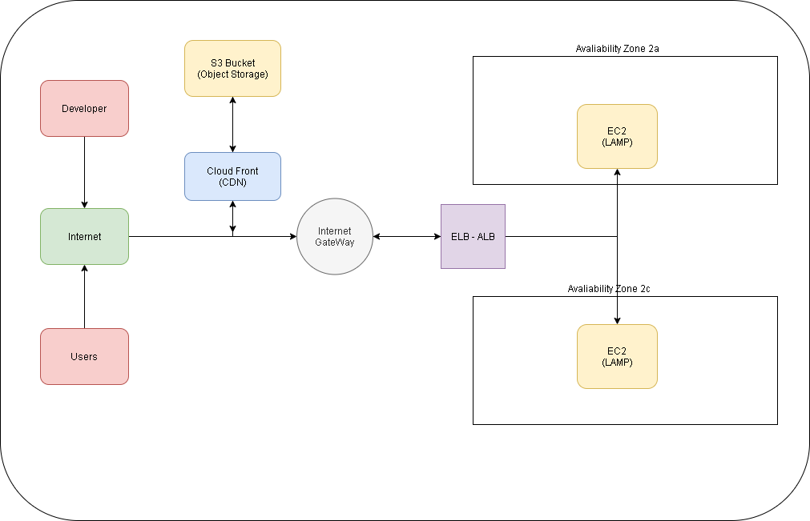

# 스스로 구축하는 AWS 클라우드 인프라 

****


## 1. 서버리스 웹 호스팅과 Cloud Front로 웹 가속화 구성하기


### 1.1 아키텍처에 구현할 기술

서버가 없어도 구성이 가능한 정적 웹 호스팅을 만들고, 웹 속도를 높이기 위하여 콘텐츠
전송 네트워크(CDN) 서비스를 연동합니다. 


* **필요 AWS 서비스**

  	- Amazon S3

  ​		- Amazon CloudFront (AWS Edge Location은 전세계 160군데에 있음)


- **기타 필요사항**
  실습을 위한 간단한 HTML파일 또는 소스


- **아키텍쳐 구성**
  인터넷 > 클라우드프론트(CDN) > S3 Bucket(오브젝트 스토리지,웹상에서 콘텐츠 바로 제공가능)

****


## 아키텍쳐 구현 순서

1. S3 정적 웹 호스팅 구성하기
  1.1  S3 Bucket 생성(디폴트 옵션대로 설치,서버없이 웹 호스팅)

  1.1.1 S3버킷 생성후 Permission에 버킷 Policy를 생성/편집해서 json 형태로 기입

  1.1.2 Bucket Policy editor에서 Resource 부분에서 경로밑에 /*를 기입해야 S3 버킷의 모든 콘텐츠에 접근가능해짐

  1.1.3 속성과 Object URL이 업로드한 콘텐츠에 명시되있음

  1.2. 정적 웹 사이트 호스팅 활성화
  1.3. 웹 사이트 엔드포인트 테스트


2. CloudFront를 이용해 웹 사이트 속도 높이기
   2.1. CloudFront 배포만들기

   2.1.1 Select delivery method : WEB , RTMP 2가지 중 WEB 선택
   2.1.2 Create distribution 선택
   2.1.2.1 Origin Domain Name 선택(1번에서 생성한 S3버킷 선택)

   2.1.2.2 Origin ID : s3 bucket id ,Origin Connection Attempts :3 , Origin Connection Timeout : 10  

   2.1.2.3 Default Cache Behavior Settings {

   ```
   Path Pattern : Default (*)
   Viewer Protocol Policy : HTTP AND HTTPS
   Allowed HTTP Methods : GET,HEAD 
   Cached HTTP Methods GET,HEAD (Cached by default)
   Cache and Origin request Settings : Use a cache policy and origin request policy 
   Cache Policy : Managed-CachingOptimized 
   Smooth Streaming : No(default)
   Restrict Viewer Access (Use Signed URLS or Signed Cookies)
   Compress Objects Automatically : No
   ```

   }

   

   2.1.2.4 Distribution Settings {

   ```
   Price Class : 지역선택을 하면됨
   ( 
   1. Use Only U.S , Canada and Europe  (미국,캐나다 유럽만 사용 )
   2. Use U.S , Canada, Europe, Asia, Middle East(중동) and Africa (미국,캐나다,유럽,아시아, 중동,아프리카)
   3. Use All Edge Locations (Best Perfomance)
   )
   AWS WAF Web ACL : NONE 
   Alternate Domain Names (CNAMES) : ' '
   SSL Certificate : Default CloudFront Certificate (*.cloudfront.net)
   Supported HTTP Versions : HTTP/2. 
   Default Root Object : ' '
   Logging : ' '
   Enable IPv6 : 체크
   comment : ' '
   Distribution State : Enabled
   
   ```

   }

   

   2.2. 생성된 CloudFront 도메인 확인

   - 보통생성 시간은 약 5분~10분정도 소요되며,  위의 설명을 따라서, 옵션대로 셋팅하면 전세계 EDGE Location에 생성되는 것이다. 


****

- **용어 정리**
  CDN: Contents Delivery Networks의 줄임말로 정적콘텐츠를 캐싱해서 보여주는 서비스

​		Object storage : 하나의 파일과 그 파일을 설명하는 메타데이터까지 오브젝트라고 함
​		(S3는 오브젝트를 버킷이라고 하는 저장공간에 저장함, 디렉토리의 개념임(PC), 버킷의 권한
​		조정을 통해 오브젝트를 업로드하고, 삭제하는것을 조정함


****


## 2. EC2 - LAMP - ELB 구성하기


* 사전 지식 및 셋팅


EC2 :  AWS에서 컴퓨터 한대를 임대할 때 쓰는 단위, 임대서버라고 보면된다. (Elastic Compute Cloud)

LAMP :Linux + Apache + Mysql,MariaDB + PHP,Perl,Python를 합친 단어, 4개 스택을 많이 써서 그렇다.

ELB : (Elastic Load Balancer) 
기존에 사용하던 서비스중 L4, Load Balance 서비스라고 생각하면 이해하기 쉽습니다. 웹 서버 및 각종 서버에 사용량과 접속자가 많은 겨우 트래픽에 대한 부하 분산을 통해 네트워크 트래픽을 인스턴스로 전달합니다.


· LAMP 웹 서버 설치를 위한 User Data 스크립트는 EC2가 생성되는 과정에서 Apache 웹 서버, MySQL 데이터베이스, PHP 어플리케이션이 설치될 수 있게 해줍니다.

· 스크립트의 세부 내용은 아래와 같으며, EC2 생성 단계 중 User Data에 아래 내용을 복사하여 붙여넣으셔도 동일한 LAMP 웹 서버가 설치됩니다.


setting_LAMP.sh

```
#!/bin/bash
yum update -y
amazon-linux-extras install -y lamp-mariadb10.2-php7.2 php7.2
yum install -y httpd mariadb-server
systemctl start httpd
systemctl enable httpd
usermod -a -G apache ec2-user
chown -R ec2-user:apache /var/www
chmod 2775 /var/www
find /var/www -type d -exec chmod 2775 {} \;
find /var/www -type f -exec chmod 0664 {} \;
echo "<?php phpinfo(); ?>" > /var/www/html/phpinfo.php
if [ ! -f /var/www/html/bootcamp-app.tar.gz ]; then
cd /var/www/html
wget https://s3.amazonaws.com/immersionday-labs/bootcamp-app.tar
tar xvf bootcamp-app.tar
chown apache:root /var/www/html/rds.conf.php
wget https://www.phpmyadmin.net/downloads/phpMyAdmin-latest-all-languages.tar.gz
mkdir phpMyAdmin && tar -xvzf phpMyAdmin-latest-all-languages.tar.gz -C phpMyAdmin --strip-components 1
cd /var/www/html/phpMyAdmin/
cp config.sample.inc.php config.inc.php
fi
```


****





### 2.1 아키텍처에 구현할 기술

Linux 기반의 가상 서버에 Apache 웹서버, MySQL 데이터베이스, PHP 어플리케이션을 구축하고 로드 밸런서를 이용하여 이중화 구성을 만듭니다.


* **필요 AWS 서비스** 

​    	 Amazon Elastic Comput Cloud(EC2)

  	   Amazon Virtual Private Cloud(VPC)

​		 Elastic Load Balancing / Application Load Balancer

* **기타 필요 사항**

  Linux O/S

  간단한 MYSQL 및 Query 이해


## 아키텍쳐 구현 순서


1. Amazon Linux 2에 LAMP 웹 서버 설치하기

   1.1 EC2 생성 시 User Data 스크립트 추가하여 자동으로 설치

   1.2 LAMP 서버 테스트

2. Custom AMI 생성
   2.1 Create Image 

   ```
   Image name : 이미지 네임 설정
   Image description : 이미지 네임 설정 동일
   No reboot : 체크 (서비스 중인 EC2를 리붓하게 되면 서비스 장애가 발생할 수도 있어서 체크하는게 좋음)
   ```

   

3. Custom AMI로 두 번째 LAMP 서버 생성

4. ssh 접속 후 데이터 베이스 보안 설정


2. Application Load Balancer 시작하기

   2.1 Load Balancer 유형 선택
   	   Load Balancing / Load Balancers / Create Load Balancer
          Application Load Balancer / Network Load Balancer / Classic Load Balancer

    	  Step1 Configure Load Balancer

   ```
   Name : 설정
   Scheme : Internet-facing (public) 
   Ip address type : ipv4 
   
   Listeners  (필요한 프로토콜과 포트를 추가하면됨)
   -Load Balancer Protocol : HTTP
   -Load Balancer Port : 80
   
   
   Availability Zones
   VPC : 디폴트설정
   Availability Zones : app1, app2 와 같이 설정하고 , subnet-default 설정
   
   
   Tags
   key  : Name
   value : lab-web-alb
   ```

     	 Step 2, 3 보안그룹설정 필수

   ​		Step 4 라우팅 컨피그 

   ```
   Target Group 설정
   Name : 설정
   Target : Instance 
   Protocol : HTTP 
   Port 80
   
   Health Check
   Protocol : HTTP 
   Path : / 
   
   Advanced health check Settings  (디폴트)
   Port : traffic port
   Healthy threshold : 5
   Unhealthy threshold : 2 
   Timeout : 5
   Interval : 30
   Success codes : 200
   
   
   ```

   ​      Step 5 Register Target 

   ​	  Step 6 Review 

   ```
   alb의 DNS name이 중요하다. 
   위와 같이 설정하면 alb(application load balancer)의 DNS name으로 접속시 로드밸런싱 설정되 있는 서버 2개 중 1대로 접속된다.
   ```

   

   2.2 Load Balancer 및 리스너 구성

   2.3 Load Balancer에 대한 보안 그룹 구성

   2.4 대상 그룹 구성

   2.5 대상 그룹에 대상 등록

   2.6 Load Balancer 생성 및 테스트

   2.7 Load Balancer 삭제 선택사항

