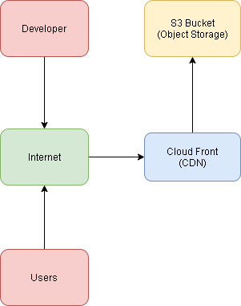

# 스스로 구축하는 AWS 클라우드 인프라 

****


| 작성날짜 | 2022-02-19 |
| -------- | ---------- |
| 작성자   | 서학용     |
| 버전     | v1.0       |


## 1. 서버리스 웹 호스팅과 Cloud Front로 웹 가속화 구성하기


### 1.1 아키텍처에 구현할 기술

서버가 없어도 구성이 가능한 정적 웹 호스팅을 만들고, 웹 속도를 높이기 위하여 콘텐츠
전송 네트워크(CDN) 서비스를 연동합니다. 





* **필요 AWS 서비스**

  	- Amazon S3

  ​		- Amazon CloudFront (AWS Edge Location은 전세계 160군데에 있음)


- **기타 필요사항**
  실습을 위한 간단한 HTML파일 또는 소스


- **아키텍쳐 구성**
  인터넷 > 클라우드프론트(CDN) > S3 Bucket(오브젝트 스토리지,웹상에서 콘텐츠 바로 제공가능)

****


### 1.2 아키텍쳐 구현 순서

1. S3 정적 웹 호스팅 구성하기</br>
  1.1  S3 Bucket 생성(디폴트 옵션대로 설치,서버없이 웹 호스팅)</br>

  1.1.1 S3버킷 생성후 Permission에 버킷 Policy를 생성/편집해서 json 형태로 기입</br>

  1.1.2 Bucket Policy editor에서 Resource 부분에서 경로밑에 /*를 기입해야 S3 버킷의 모든 콘텐츠에 접근가능해짐</br>

  1.1.3 속성과 Object URL이 업로드한 콘텐츠에 명시되있음</br>

  1.2. 정적 웹 사이트 호스팅 활성화</br>
  1.3. 웹 사이트 엔드포인트 테스트</br>


2. CloudFront를 이용해 웹 사이트 속도 높이기</br>
   2.1. CloudFront 배포만들기</br>

   2.1.1 Select delivery method : WEB , RTMP 2가지 중 WEB 선택</br>
   2.1.2 Create distribution 선택</br>
   2.1.2.1 Origin Domain Name 선택(1번에서 생성한 S3버킷 선택)</br>

   2.1.2.2 Origin ID : s3 bucket id ,Origin Connection Attempts :3 , Origin Connection Timeout : 10  </br>

   2.1.2.3 Default Cache Behavior Settings {

   ```
   Path Pattern : Default (*)
   Viewer Protocol Policy : HTTP AND HTTPS
   Allowed HTTP Methods : GET,HEAD 
   Cached HTTP Methods GET,HEAD (Cached by default)
   Cache and Origin request Settings : Use a cache policy and origin request policy 
   Cache Policy : Managed-CachingOptimized 
   Smooth Streaming : No(default)
   Restrict Viewer Access (Use Signed URLS or Signed Cookies)
   Compress Objects Automatically : No
   ```

   }

   

   2.1.2.4 Distribution Settings {

   ```
   Price Class : 지역선택을 하면됨
   ( 
   1. Use Only U.S , Canada and Europe  (미국,캐나다 유럽만 사용 )
   2. Use U.S , Canada, Europe, Asia, Middle East(중동) and Africa (미국,캐나다,유럽,아시아, 중동,아프리카)
   3. Use All Edge Locations (Best Perfomance)
   )
   AWS WAF Web ACL : NONE 
   Alternate Domain Names (CNAMES) : ' '
   SSL Certificate : Default CloudFront Certificate (*.cloudfront.net)
   Supported HTTP Versions : HTTP/2. 
   Default Root Object : ' '
   Logging : ' '
   Enable IPv6 : 체크
   comment : ' '
   Distribution State : Enabled
   
   ```

   }

   

   2.2. 생성된 CloudFront 도메인 확인</br>

   - 보통생성 시간은 약 5분~10분정도 소요되며,  위의 설명을 따라서, 옵션대로 셋팅하면 전세계 EDGE Location에 생성되는 것이다. </br>


****

- **용어 정리**
  CDN: Contents Delivery Networks의 줄임말로 정적콘텐츠를 캐싱해서 보여주는 서비스</br>

​		Object storage : 하나의 파일과 그 파일을 설명하는 메타데이터까지 오브젝트라고 함</br>
​		(S3는 오브젝트를 버킷이라고 하는 저장공간에 저장함, 디렉토리의 개념임(PC), 버킷의 권한</br>
​		조정을 통해 오브젝트를 업로드하고, 삭제하는것을 조정함</br>


****


## 2. EC2 - LAMP - ELB 구성하기


* 사전 지식 및 셋팅</br>


EC2 :  AWS에서 컴퓨터 한대를 임대할 때 쓰는 단위, 임대서버라고 보면된다. (Elastic Compute Cloud)</br>

LAMP :Linux + Apache + Mysql,MariaDB + PHP,Perl,Python를 합친 단어, 4개 스택을 많이 써서 그렇다.</br>

ELB : (Elastic Load Balancer) </br>
기존에 사용하던 서비스중 L4, Load Balance 서비스라고 생각하면 이해하기 쉽습니다. 웹 서버 및 각종 서버에 사용량과 접속자가 많은 겨우 트래픽에 대한 부하 분산을 통해 네트워크 트래픽을 인스턴스로 전달합니다.</br>


· LAMP 웹 서버 설치를 위한 User Data 스크립트는 EC2가 생성되는 과정에서 Apache 웹 서버, MySQL 데이터베이스, PHP 어플리케이션이 설치될 수 있게 해줍니다.</br>

· 스크립트의 세부 내용은 아래와 같으며, EC2 생성 단계 중 User Data에 아래 내용을 복사하여 붙여넣으셔도 동일한 LAMP 웹 서버가 설치됩니다.</br>


setting_LAMP.sh

```
#!/bin/bash
yum update -y
amazon-linux-extras install -y lamp-mariadb10.2-php7.2 php7.2
yum install -y httpd mariadb-server
systemctl start httpd
systemctl enable httpd
usermod -a -G apache ec2-user
chown -R ec2-user:apache /var/www
chmod 2775 /var/www
find /var/www -type d -exec chmod 2775 {} \;
find /var/www -type f -exec chmod 0664 {} \;
echo "<?php phpinfo(); ?>" > /var/www/html/phpinfo.php
if [ ! -f /var/www/html/bootcamp-app.tar.gz ]; then
cd /var/www/html
wget https://s3.amazonaws.com/immersionday-labs/bootcamp-app.tar
tar xvf bootcamp-app.tar
chown apache:root /var/www/html/rds.conf.php
wget https://www.phpmyadmin.net/downloads/phpMyAdmin-latest-all-languages.tar.gz
mkdir phpMyAdmin && tar -xvzf phpMyAdmin-latest-all-languages.tar.gz -C phpMyAdmin --strip-components 1
cd /var/www/html/phpMyAdmin/
cp config.sample.inc.php config.inc.php
fi
```


****


### 2.1 아키텍처에 구현할 기술</br>

Linux 기반의 가상 서버에 Apache 웹서버, MySQL 데이터베이스, PHP 어플리케이션을 구축하고 로드 밸런서를 이용하여 이중화 구성을 만듭니다.</br>


* **필요 AWS 서비스** </br>

​    	 Amazon Elastic Comput Cloud(EC2)</br>

  	   Amazon Virtual Private Cloud(VPC)

​		 Elastic Load Balancing / Application Load Balancer</br>

* **기타 필요 사항</br>**

  Linux O/S</br>

  간단한 MYSQL 및 Query 이해</br>


### 2.2 아키텍쳐 구현 순서


1. Amazon Linux 2에 LAMP 웹 서버 설치하기</br>

   1.1 EC2 생성 시 User Data 스크립트 추가하여 자동으로 설치</br>

   1.2 LAMP 서버 테스트</br>

2. Custom AMI 생성</br>
   2.1 Create Image </br>

   ```
   Image name : 이미지 네임 설정
   Image description : 이미지 네임 설정 동일
   No reboot : 체크 (서비스 중인 EC2를 리붓하게 되면 서비스 장애가 발생할 수도 있어서 체크하는게 좋음)
   ```

   

3. Custom AMI로 두 번째 LAMP 서버 생성</br>

4. ssh 접속 후 데이터 베이스 보안 설정</br>


2. Application Load Balancer 시작하기</br>

   2.1 Load Balancer 유형 선택</br>
   	   Load Balancing / Load Balancers / Create Load Balancer</br>
          Application Load Balancer / Network Load Balancer / Classic Load Balancer</br>

    	  Step1 Configure Load Balancer

   ```
   Name : 설정
   Scheme : Internet-facing (public) 
   Ip address type : ipv4 
   
   Listeners  (필요한 프로토콜과 포트를 추가하면됨)
   -Load Balancer Protocol : HTTP
   -Load Balancer Port : 80
   
   
   Availability Zones
   VPC : 디폴트설정
   Availability Zones : app1, app2 와 같이 설정하고 , subnet-default 설정
   
   
   Tags
   key  : Name
   value : lab-web-alb
   ```

   ​		Step 2, 3 보안그룹설정 필수

   ​		Step 4 라우팅 컨피그 

   ```
   Target Group 설정
   Name : 설정
   Target : Instance 
   Protocol : HTTP 
   Port 80
   
   Health Check
   Protocol : HTTP 
   Path : / 
   
   Advanced health check Settings  (디폴트)
   Port : traffic port
   Healthy threshold : 5
   Unhealthy threshold : 2 
   Timeout : 5
   Interval : 30
   Success codes : 200
   
   
   ```

   ​      Step 5 Register Target </br>

   ​	  Step 6 Review </br>

   ```
   alb의 DNS name이 중요하다. 
   위와 같이 설정하면 alb(application load balancer)의 DNS name으로 접속시 로드밸런싱 설정되 있는 서버 2개 중 1대로 접속된다.
   ```

   

   2.2 Load Balancer 및 리스너 구성</br>

   2.3 Load Balancer에 대한 보안 그룹 구성</br>

   2.4 대상 그룹 구성</br>

   2.5 대상 그룹에 대상 등록</br>

   2.6 Load Balancer 생성 및 테스트</br>

   2.7 Load Balancer 삭제 선택사항</br>


****


## 3. VPC와 중계 서버(Bastion) 구성하기


### 3.1 아키텍처에 구현할 기술</br>

가상의 네트워크에서 인터넷과 연결 또는 연결되지 않은 하위 네트워크를 만들고 다른 가상 서버와 연결하기 위한 중계 서버를 구성합니다. </br>


* 필요 AWS 서비스</br>

  Amazon EC2</br>

  Amazon Virtual Private Cloud(VPC )</br>


* 기타 필요 사항</br>

  CIDR (IP주소 할당 방법, 클래스가 없는 도메인간의 라우팅 기법)</br>

  Subnetting (CIDR로 할당한 IP대역을 서비스하고자 하는네트워크에 맞게 IP주소 할당 )</br>

​		   Public Subnet :  외부인터넷과 연결 가능</br>

​    	   Private Subnet : 외부인터넷과 연결은 안됨</br>


### 3.2 아키텍쳐 구현 순서</br>


1. Custom VPC-Subnet 생성하기</br>

   1.1 VPC : CIDR 10.0.0.0/16</br>

   ```
   Your Vpcs 선택 
   Create VPC
   Name tag : lab-vpc (이름 임의설정)
   IPv4 CIDR block : 10.0.0.0/16 (Subnet 이상으로 IP 설정해주는 칸)
   IPv6 CIDR block No IPv6 CIDR Block (디폴트)
   Tenacy : Default
   ```

   ​		

   ​		

   1.2 Subnet(Public/Private) 생성하기</br>

   1.2.1 Public 10.0.1.0/24 , 10.0.2.0/24</br>

   ```
   Subnet 선택
   Create Subnet
   Name tag : lab-web-pub1-2a
   VPC : 위에서생성한 VPC
   Availability Zone : 2a
   VPC  CIDRs : CIDR(10.0.0.0/16, status:associated)
   IPv4 CIDR block : 10.0.1.0/24 (이렇게 하면 총 251개의 아이피를 사용할 수 있음)
   
   ```

   

   ```
   Subnet 선택
   Create Subnet
   Name tag : lab-web-pub1-2c
   VPC : 위에서생성한 VPC
   Availability Zone : 2c
   VPC  CIDRs : CIDR(10.0.0.0/16, status:associated)
   IPv4 CIDR block : 10.0.2.0/24 (이렇게 하면 총 251개의 아이피를 사용할 수 있음)
   
   ```

   

   

   

   

   1.2.2 Private 10.0.3.0/24, 10.0.4.0/24</br>

   

   ```
   Subnet 선택
   Create Subnet
   Name tag : lab-web-pri1-2a
   VPC : 위에서생성한 VPC
   Availability Zone : 2a
   VPC  CIDRs : CIDR(10.0.0.0/16, status:associated)
   IPv4 CIDR block : 10.0.3.0/24 (이렇게 하면 총 251개의 아이피를 사용할 수 있음)
   
   ```

   

   ```
   Subnet 선택
   Create Subnet
   Name tag : lab-web-pri2-2c
   VPC : 위에서생성한 VPC
   Availability Zone : 2c
   VPC  CIDRs : CIDR(10.0.0.0/16, status:associated)
   IPv4 CIDR block : 10.0.4.0/24 (이렇게 하면 총 251개의 아이피를 사용할 수 있음)
   
   ```

   

   

   

   1.2.3 Private 10.0.5.0/24, 10.0.6.0/24</br>

   ```
   Subnet 선택
   Create Subnet
   Name tag : lab-web-pri3-2a
   VPC : 위에서생성한 VPC
   Availability Zone : 2a
   VPC  CIDRs : CIDR(10.0.0.0/16, status:associated)
   IPv4 CIDR block : 10.0.5.0/24 (이렇게 하면 총 251개의 아이피를 사용할 수 있음)
   
   ```

   

   ```
   Subnet 선택
   Create Subnet
   Name tag : lab-web-pri4-2c
   VPC : 위에서생성한 VPC
   Availability Zone : 2c
   VPC  CIDRs : CIDR(10.0.0.0/16, status:associated)
   IPv4 CIDR block : 10.0.6.0/24 (이렇게 하면 총 251개의 아이피를 사용할 수 있음)
   
   ```

   

​		


2. Internet Gateway-Routing Table 설정하기</br>

​		2.1 Internet Gateway 만들기</br>

​			 Name tag: lab-web-igw </br>

 			Attach to VPC :  위에서 만든 vpc로 연결

​			

​		2.2 Routing table-Public 만들기</br>

​			Routes :  lab-web-rt-pub</br>

​		2.3 Routing-table-Private 만들기</br>

​			Routes : lab-web-rt-pri</br>

​		2.4 Public subnet에 Routing table-Public 연결</br>


```
Edit routes
Destination : 0.0.0.0/0
Target : igw (위에서 만든 인터넷 게이트웨이)


Edit subnet associations 
위에서 만든 public용 Subnet 2개 선택

```


​		2.5 Private subnet에 Routing table-Private 연결</br>


```
Edit subnet associations
위에서 만든 private용  Subnet 4개 선택
```


3. Nat Gateway 구성하기 (private ec2가 외부와 통신할 수 있게 구성)</br>

   3.1 NAT Gateway 만들기</br>

   ```
   NAT Gateway  선택
   Create NAT gateway 
   name : lab-web-nat-2a
   subnet : lab-web-pub1-2a
   Elastic IP allocation ID 할당
   
   
   Create NAT gateway 
   name : lab-web-nat-2c
   subnet : lab-web-pub1-2c
   Elastic IP allocation ID 할당
   
   ```

   

   3.2 Route table에 NAT Gateway 업데이트</br>

   ```
   lab-web-rt-pri-2a Edit subnet associations  > (2a 영역만 있는 서브넷을 설정) > 10.0.0.3, 10.0.0.5
   lab-web-rt-pri-2c Edit subnet associations  > (2c 영역만 있는 서브넷을 설정) > 10.0.0.4, 10.0.0.6
   lab-web-rt-pub > (public용 서브넷 2개 설정) > 10.0.0.1 , 10.0.0.2 
   
   ```

   

   3.3 NAT Gateway 테스트


4. Bastion Host 생성하기</br>

​		4.1 Bastion Host 생성하기</br>

​		AMI 생성, name : lab-web-srv-bastion , t2-micro , 보안그룹 :lab-web-bastion-sg</br>

​		4.2 Key Pair(xxx.pem) 복사하기</br>

​		4.3 Bastion Host에 접속하고, Private subnet의 EC2에 접속하기</br>
​		private subnet - ec2가 라우팅 테이블에 외부 인터넷 통신 되게끔 설정필요, 아래설정 안하면 외부통신 안됨</br>

```
Destination : 0.0.0.0/0
Target : nat-위에서 설정한 nat-2a
status : active
propagated : No
```

```
Destination : 0.0.0.0/0
Target : nat-위에서 설정한 nat-2c
status : active
propagated : No
```


****


## 4. RDS for MYSQL 생성하기</br>


사전 셋팅 </br>

```
■ 실습 진행 중 참고 사항

[Amazon RDS를 통한 MySQL Database 및 Security Group 생성]

· 실습 영상 중 Database 생성에서 Template은 'Dev/Test'를 선택하였지만 'Free tier'를 선택하셔도 괜찮습니다. 이 경우 DB instance size는 실습 영상에서 설정하는 Burstable class / db.t2.mircro로 자동 선택되며 다른 class 및 instance type으로 변경할 수 없습니다.

· Create Database 클릭 후 Database 생성까지는 약 10분~15분 정도의 긴 시간이 소요되며, 원활한 실습 영상을 위하여 대기시간은 편집하였습니다.

[SSH 및 Web으로 Database 관리를 위한 RDS for MySQL 접속]

· 실습 영상 중 사용되는 주요 명령어는 다음과 같습니다.

  - PuTTY에서 RDS for MySQL 접속 : mysql -u<user> -p -h <rds endpoint>

  - 데이터베이스 보기 : show databases;

  - 데이터베이스 사용 : use <database name>;

  - 테이블 보기 : show tables;

  - 테이블 검색 : select * from <table name>;

  - 접속 해제 : exit

  - phpMyAdmin 환경 설정을 위한 Config 파일에 RDS 정보 입력

    : 파일 위치 이동 : cd/var/www/html/phpMyAdmin

    : 편집기로 Config 파일 열기 : sudo vi config.inc.php
```


### 4.1 아키텍쳐에 구현할 기술</br>

완전 관리형 MySQL 데이터 베이스를 구성하고 리눅스 기반의 가상서버에 MYSQL 클라이언트로 연결합니다.</br>


* 필요 AWS 서비스</br>

  Amazon Relational Database Service(RDS)</br>

* 기타 필요 사항</br>

  간단한 Query문 및 PHP 문법</br>


### 4.2 아키텍처 구현 순서

1.RDS for MySQL 구성하기</br>

1.1 Database creation method 선택</br>

1.2 Database Engine 선택</br>

1.3 DB 식별, Master Username/PW 셋팅</br>

1.4 DB Instance size 선택</br>

1.5 네트워크 설정</br>

```
Connectivity 
Virtual private cloud : 해당 vpc 선택 (lab-vpc)
Subnet group : default-vpc 선택

```


****


## 5. Auto Scaling으로 확장성 및 탄력성 구현하기


### 5.1 아키텍처에 구현할 기술</br>

서버의  특정한 설정값에 따라 가상 서버가 자동으로 늘어나거나 줄어드는 기능을 구성하여 확장성과 탄력성을 구현합니다.</br>


* 필요 AWS 서비스</br>

  Auto Scaling </br>

* 서버 기준값 보다 서버가 늘어나면 Scaling Out</br>
* 서버 기준값 보다 서버가 줄어들면 Scaling in</br>


### 5.2 아키텍처 구현 순서


1. Launch Configuration 생성하기</br>

   1.1 Launch Configuration Name 입력</br>

   ```
   Create Load Balancer
   > application load balancer 선택
   
   Name : lab-web-alb-asg 
   Scheme : internet-facing (인터넷을 통해서 설정,외부통신됨)
   IP address type : Ipv4
   
   Availability Zones
   VPC 선택
   public vpc 2개 선택(2a,2c)
   
   
   Tag 
   Key : Name
   Value : lab-web-ali-asg
   
   ```

   

   1.2 Amazon Machine Image (AMI) 선택</br>

   1.3 Instance Type 선택</br>

   1.4 Advanced details에서 User data에 스크립트 추가입력</br>

   1.5 Storage 입력</br>

   1.6 Security Group 선택</br>

   ```
   Create a new security group
   Name: lab-web-alb-asg
   Type : Custom TCP
   Protocol : TCP
   Port Range :80
   Source 
   custom : 0.0.0.0/0
   
   ```

   

   1.7 Key Pair 선택</br>


2. Auto Scaling Group 생성하기</br>

   2.1 Auto Scaling group name 입력</br>

   2.2 Launch configuration 선택</br>

   ```
   Name : lab-web-lc
   AMI : custom AMI
   Instance Type : t2 micro 
   Advanced details
   	User Data : 다른 컴포넌트와 연동하는 스크립트 입력 가능
   
   
   ```

   

   2.3 Network 구성에서 VPC , Subnet 선택</br>

   ```
   VPC : lab-vpc
   
   
   Subnet : pri1-2a , pri2-2c 2개 선택
   (
   오토스케일링에서는 private ec2를 셋팅해서 alb통해서 트래픽 나가도록 할 예정
   )
   ```

   

   2.4 Load Balancer 선택</br>

   ```
   Load balancing 
   Application Load Balancer or Network Load Balancer 선택
   
   ```

   

   2.5 Configure group size and scaling policies에서 Desire/Min/Max 값, CPU 값 30을 선택</br>

   ```
   Desired capacity : 2 
   Minimum capacity : 2 (최소 2개)
   Maximum capacity : 4 (최대 4개)
   
   Scaling policies - optional 
   특정 지표로 Auto Scaling이 되게끔 정책을 선택하는 메뉴
   
   Policies  : Target tracking scaling policy  선택
   Name : Target Tracking Policy 
   Metric type : Average CPU utilization (측정 지표중  cpu 가용량에 따라 Auto Scaling하겠다는 뜻)
   Target value : 50 ( cpu 사용률이 50프로가 넘으면 ec2가 늘어난다는 뜻 ,수치가 중요)
   ```

   

   2.6 Add notifications</br>

   ```
   Auto Scaling 이벤트가 발생했을 떄 알람을 받는 기능
   ```

   

   2.7 Add tags</br>

   ```
   중요함
   ec2가 여러개 있고 , 이것이 새로  생성될 때 Auto Scaling으로 생긴것인지, 기존 Ec2 것인지 구별하기 위함
   
   Tag 
   Key : Name 
   value : asg 
   ```

   

​		2.8 test </br>

```
public 도메인을 이용해서 웹에 접속한 뒤, LOAD TEST를 통해 CPU 사용률을 100으로 하면서 Auto Scaling을 테스트 해볼 수 있음

Scaling out : load.php 파일경로로 옮겨지면서 CPU 사용률 100%로 됨
Scaling in  : url/load.php에서  load.php를 지우고 상위 url로 옮기면됨
```


